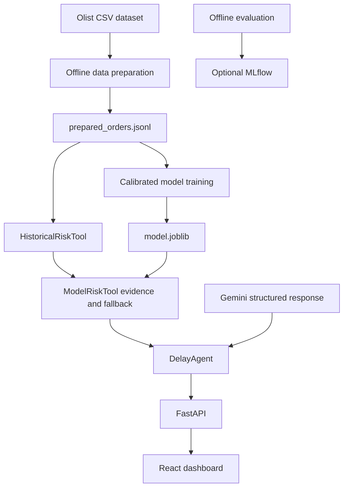

# Architecture

**Analyzed:** 2026-07-13
**Pattern:** Layered agent -> API -> product, backed by an offline data/model build.

## High-Level Structure

## Runtime Prediction Flow

1. The dashboard validates an order and sends `POST /predict-delay`.
2. Pydantic validates route and numeric inputs.
3. `ModelRiskTool` obtains traceable historical evidence and, when `MODEL_PATH` loads successfully, replaces the risk score with the calibrated probability.
4. Deterministic output policy derives a safe explanation, action intent and recommended action.
5. The LLM may rewrite the two visible fields under a strict JSON Schema. Its action is accepted only when `action_intent` matches the deterministic policy.
6. Missing configuration, provider errors, quota exhaustion, malformed output or intent mismatch degrade to deterministic text.
7. The API returns evidence, guardrails, latency and optional token usage; the dashboard aggregates session-only observability.

## Main Components

### Offline data and model build

**Location:** `backend/app/data_prep.py`, `prepare_data.py`, `feature_encoding.py`, `train_model.py`.

The Docker builder reads the raw CSVs, creates 96,470 labeled order records and trains `model.joblib`. Both artifacts are copied into the final API image; runtime does not require raw CSVs or persistent disk.

### Risk layer

**Location:** `backend/app/risk_tool.py`, `model_risk_tool.py`.

The historical tool provides segment, sample and explanatory factors. The model tool preserves that evidence while using the calibrated classifier for the production score. Missing or corrupt model artifacts fall back to historical scoring behind the same method contract.

### Agent and guardrails

**Location:** `backend/app/agent.py`, `explanation.py`, `llm.py`, `schemas.py`.

Risk computation is deterministic/model-backed; the LLM is limited to wording. Structured output and intent compatibility prevent it from changing the safe operational policy.

### API and observability

**Location:** `backend/app/api.py`, `health.py`.

FastAPI exposes health and prediction endpoints, restricts CORS when `FRONTEND_ORIGIN` is set and emits JSON logs with latency, guardrails, model and tokens.

### Operational dashboard

**Location:** `frontend/src/App.jsx`, `api.js`, `styles.css`.

The UI keeps a browser-local order queue, classifies selected items sequentially, presents evidence/fallback states and aggregates classified orders, high risk, average latency, guardrails and LLM tokens for the current session.

### Evaluation and tracking

**Location:** `backend/app/evaluate.py`, `mlflow_tracking.py`, `backend/data/eval_*.json`.

The historical baseline uses leave-one-out scoring; the model uses out-of-fold probabilities. Results include alarm precision/recall, calibration bands, fallback and per-state recall. MLflow logging is optional.

## Deployment

- Local: Compose builds the API and Nginx frontend images; no backend runtime volume is declared.
- Production: `render.yaml` provisions a Docker Web Service and a Static Site.
- The free API service may sleep after inactivity, so the frontend polls health for up to approximately 90 seconds before declaring it unavailable.
