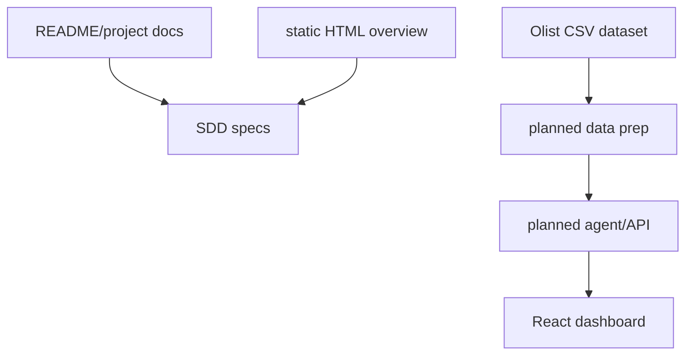
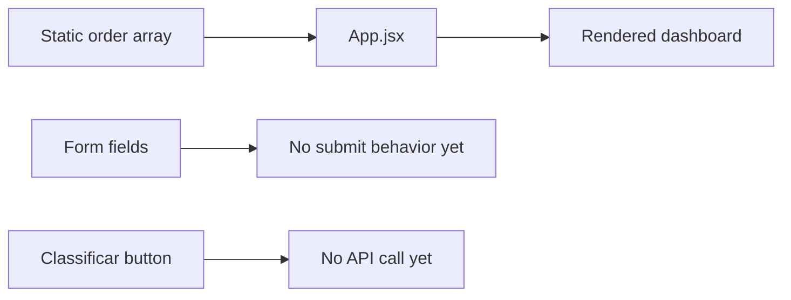
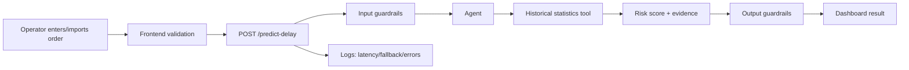

# Architecture

**Pattern:** Early-stage single frontend app plus local dataset and planning documents.

## High-Level Structure

## Identified Patterns

### Static React Dashboard

**Location:** `frontend/src/App.jsx`
**Purpose:** Represent the future operational product as a tower-of-control dashboard.
**Implementation:** A single `App` component renders topbar metrics, an order entry form and a table populated from a static `orders` array.
**Example:** The `orders` constant contains route, category, promised date, freight, status and risk placeholders.

### CSS-Only Design System

**Location:** `frontend/src/styles.css`
**Purpose:** Define spacing, typography, buttons, cards, tables and responsive behavior without a component library.
**Implementation:** CSS classes such as `.app-shell`, `.topbar`, `.summary-grid`, `.workspace`, `.button`, `.metric-card`.
**Example:** The layout switches from sidebar/table grid to single-column under `920px`.

### Static Project Direction Document

**Location:** `projeto_agente_atraso_visao_geral.html`
**Purpose:** Explain the chosen direction for the project.
**Implementation:** Standalone HTML/CSS document with sections for problem, agent idea, requirements, architecture, risks and scope.
**Example:** The document states the MVP should use an agent over historical data rather than train a separate ML model.

## Data Flow

### Current UI Flow

### Planned Agent Flow

## Code Organization

**Approach:** Project folder by deliverable.

**Structure:**

- `readme.md`: course-level final project instructions.
- `trilhas.md`: available tracks.
- `README-projeto.md`: problem definition for Trilha 1.3.
- `projeto_agente_atraso_visao_geral.html`: project direction.
- `dataset/`: Olist CSV files.
- `frontend/`: Vite React dashboard.
- `.specs/`: SDD documentation introduced for planning.

**Module boundaries:**

- Frontend is isolated under `frontend`.
- Dataset is read-only source material under `dataset`.
- Backend/agent modules are not present yet and should be added under `backend` or similarly scoped path.
