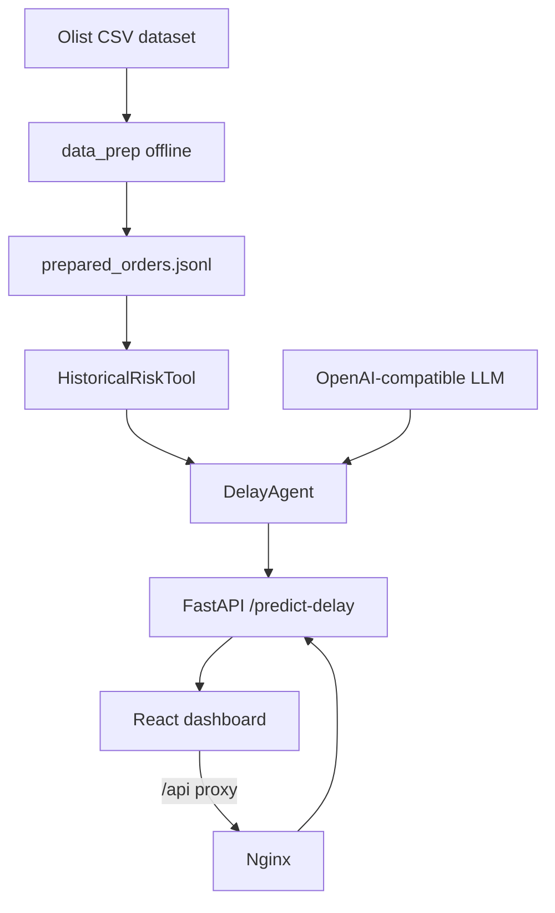
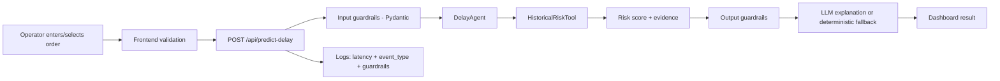

# Architecture

**Pattern:** Layered agent → API → product, fed by an offline data-prep step, packaged with Docker Compose.

## High-Level Structure

## Identified Patterns

### Operational React Dashboard

**Location:** `frontend/src/App.jsx`, `frontend/src/api.js`
**Purpose:** Tower-of-control product where an operator queues orders and classifies delay risk.
**Implementation:** The `App` component manages a local order queue and form; selected orders are POSTed to `/api/predict-delay` via `api.js`, and the response drives risk badges, an explanation/action panel and fallback/error states.
**Example:** A submitted order returns `risk_level`, `explanation`, `recommended_action`, `evidence` and `guardrails`, rendered inline.

### Layered Delay Agent (backend)

**Location:** `backend/app/`
**Purpose:** Turn an order into a traceable, explainable delay-risk prediction with graceful degradation.
**Implementation:** `api.py` (FastAPI) validates input and injects a `DelayAgent`; the agent queries `HistoricalRiskTool` (deterministic segment lookup), applies output guardrails (`explanation.py`), then rewrites the explanation with an optional LLM (`llm.py`), falling back to deterministic text. `schemas.py` holds the Pydantic contracts and input guardrails.
**Example:** With no `LLM_API_KEY` the agent still answers, appending the `llm_unconfigured` guardrail and using the deterministic explanation.

### Offline Feature Preparation

**Location:** `backend/app/data_prep.py`, `backend/app/prepare_data.py`
**Purpose:** Derive per-order features and the `delayed` target from raw Olist CSVs without leakage.
**Implementation:** Only delivered orders get a target; future-only fields (actual delivery dates, final status, reviews) are excluded. The artifact `prepared_orders.jsonl` is built once at startup and persisted in a Docker volume.

### Offline Evaluation

**Location:** `backend/app/evaluate.py`
**Purpose:** Grade the risk baseline against known labels for the report (DELAY-09).
**Implementation:** Leave-one-out over the prepared orders, reusing the risk tool's hierarchy/thresholds via a precomputed segment index; reports calibration by band, recall/precision for the alarm bands, fallback rate and a per-state breakdown.

### CSS-Only Design System

**Location:** `frontend/src/styles.css`
**Purpose:** Define spacing, typography, buttons, cards, tables and responsive behavior without a component library.
**Implementation:** CSS classes such as `.app-shell`, `.topbar`, `.summary-grid`, `.workspace`, `.button`, `.metric-card`.
**Example:** The layout switches from sidebar/table grid to single-column under `920px`.

### Project Direction Document

**Location:** `README.md`
**Purpose:** Seed the final project report and explain the initial problem framing.
**Implementation:** Markdown document with problem, stakeholders, business metrics, technical metric and MVP scope.
**Example:** The document states the MVP should classify whether an order is likely to delay and return a simple explanation.

## Data Flow

### Prediction Flow (implemented)

## Code Organization

**Approach:** Project folder by deliverable.

**Structure:**

- `readme.md`: course-level final project instructions.
- `trilhas.md`: available tracks.
- `README.md`: problem definition for Trilha 1.3.
- `dataset/`: Olist CSV files.
- `backend/`: FastAPI service, agent, risk tool, data prep, evaluation and tests.
- `frontend/`: Vite React dashboard + Nginx image.
- `docker-compose.yml`: two-service runtime (backend + frontend).
- `.specs/`: SDD documentation.

**Module boundaries:**

- Frontend is isolated under `frontend` (React product + Nginx image).
- Backend/agent lives under `backend/app`; the API is the only entry point into the agent.
- Dataset is read-only source material under `dataset`; derived features are generated into `backend/data` (gitignored, Docker volume).
- Docker Compose at the project root wires the two services.
