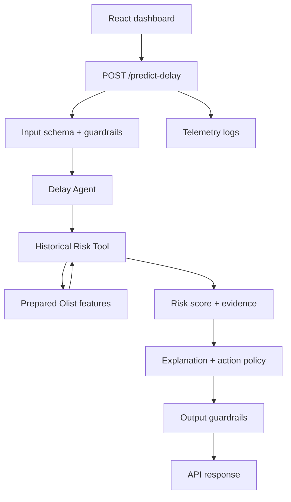

# Agente de Previsao de Atraso Design

**Spec:** `.specs/features/agente-previsao-atraso/spec.md`
**Status:** Draft

---

## Architecture Overview

O MVP usa um agente com uma ferramenta deterministica de consulta historica. O agente nao treina modelo supervisionado; ele calcula risco a partir de segmentos historicos do Olist, aplica fallback quando o segmento e pequeno, transforma evidencias em explicacao e devolve uma acao operacional.



## Code Reuse Analysis

### Existing Components to Leverage

| Component | Location | How to Use |
| --- | --- | --- |
| Dashboard shell | `frontend/src/App.jsx` | Keep the tower-of-control layout and add real state/API calls. |
| Visual styles | `frontend/src/styles.css` | Extend existing classes for risk badges, explanation panel and error states. |
| Project README | `README.md` | Preserve the problem framing, stakeholders, metrics and MVP scope. |
| Raw dataset | `dataset` | Use as source for prepared features and evaluation. |

### Integration Points

| System | Integration Method |
| --- | --- |
| Frontend -> API | HTTP `POST /predict-delay`. |
| API -> Agent | In-process service call. |
| Agent -> Historical data | Local prepared artifact loaded at startup. |
| Logging | Append structured JSON lines or stdout logs suitable for demo/report. |

---

## Components

### Data Preparation

- **Purpose:** Convert raw Olist CSVs into order-level records for risk lookup and evaluation.
- **Location:** `backend/app/data_prep.py`
- **Interfaces:**
  - `build_order_features(raw_dir: Path, output_path: Path) -> PrepSummary`
  - `load_prepared_features(path: Path) -> list[OrderFeature]`
- **Dependencies:** Raw Olist CSVs.
- **Reuses:** Dataset columns already inspected locally.

### Historical Risk Tool

- **Purpose:** Given an order, find comparable historical groups and compute risk/confidence.
- **Location:** `backend/app/risk_tool.py`
- **Interfaces:**
  - `estimate_delay_risk(order: OrderInput) -> RiskEvidence`
- **Dependencies:** Prepared order-level feature records.
- **Reuses:** Fallback hierarchy and leakage rules from spec.

### Delay Agent

- **Purpose:** Orchestrate validation context, call risk tool, produce explanation and action.
- **Location:** `backend/app/agent.py`
- **Interfaces:**
  - `classify_order(order: OrderInput) -> DelayPrediction`
- **Dependencies:** Historical Risk Tool, explanation/action policy, optional LLM client.
- **Reuses:** Deterministic evidence from risk tool.

### API

- **Purpose:** Expose the agent as an HTTP service with guardrails and telemetry.
- **Location:** `backend/app/api.py`
- **Interfaces:**
  - `POST /predict-delay`
  - `GET /health`
- **Dependencies:** Delay Agent, schemas, logger.
- **Reuses:** None existing; new backend boundary.

### Frontend API Client

- **Purpose:** Call the backend and normalize UI states.
- **Location:** `frontend/src/api.js`
- **Interfaces:**
  - `predictDelay(order)`
- **Dependencies:** Browser `fetch`.
- **Reuses:** Existing React app.

### Dashboard Integration

- **Purpose:** Let operators add/select/classify orders and inspect results.
- **Location:** `frontend/src/App.jsx`, `frontend/src/styles.css`
- **Interfaces:** UI events and rendered state.
- **Dependencies:** API client.
- **Reuses:** Existing layout.

---

## Data Models

### OrderInput

```python
class OrderInput:
    order_id: str
    customer_state: str
    seller_state: str
    product_category_name: str | None
    order_purchase_timestamp: str | None
    order_estimated_delivery_date: str | None
    freight_value: float | None
    price: float | None
    items_count: int | None
    payment_type: str | None
    payment_installments: int | None
```

### OrderFeature

```python
class OrderFeature:
    order_id: str
    delayed: bool
    customer_state: str
    seller_state: str
    same_state: bool
    product_category_name: str | None
    purchase_month: int
    purchase_weekday: int
    promised_days: float
    total_price: float
    total_freight: float
    freight_ratio: float | None
    items_count: int
    sellers_count: int
    payment_type_main: str | None
    max_installments: int | None
```

### RiskEvidence

```python
class RiskEvidence:
    risk_score: float
    risk_level: str
    confidence: str
    sample_size: int
    segment_used: str
    fallback_used: bool
    factors: list[str]
```

### DelayPrediction

```python
class DelayPrediction:
    order_id: str
    risk_score: float
    risk_level: str
    confidence: str
    explanation: str
    recommended_action: str
    evidence: RiskEvidence
    guardrails: list[str]
    fallback_used: bool
    latency_ms: int
```

---

## Feature Set

**Allowed baseline features:**

- Purchase timing: month, weekday, hour when available.
- SLA timing: days until estimated delivery, days until shipping limit if available.
- Route: customer state, seller state, same state, distance if geolocation is prepared.
- Product/order: category, item count, distinct products/sellers, price, freight, freight ratio, weight/volume if prepared.
- Payment: payment type, number of payments, installments, total value.

**Excluded from features:**

- `order_delivered_customer_date`, except for target creation.
- `order_delivered_carrier_date` for the purchase/approval baseline.
- `order_reviews` fields.
- Final `order_status` as historical feature.

---

## Fallback Hierarchy

The risk tool should try segments from specific to broad:

1. seller_state + customer_state + product_category_name.
2. seller_state + customer_state.
3. customer_state + product_category_name.
4. seller_state + product_category_name.
5. customer_state.
6. product_category_name.
7. global delivered-order baseline.

Each segment must have a minimum sample threshold. If not, move to the next fallback and report `fallback_used=true`.

---

## Error Handling Strategy

| Error Scenario | Handling | User Impact |
| --- | --- | --- |
| Missing required fields | Return validation error with field list | User sees what to fix. |
| Unsupported UF/category | Use fallback or validation warning | User sees reduced confidence. |
| Prepared data missing | API returns service unavailable fallback | User sees friendly unavailable state. |
| LLM unavailable | Use deterministic explanation template | User still receives risk and action. |
| Output missing evidence | Output guardrail blocks and returns safe fallback | User sees low-confidence response. |

---

## Tech Decisions

| Decision | Choice | Rationale |
| --- | --- | --- |
| Prediction method | Historical segment risk | Explainable, fast to implement, aligned with agent-over-data direction. |
| Target | Delivery after estimated date | Directly matches business problem. |
| UI | Existing tower-control dashboard | Already present and aligned with stakeholders. |
| Evaluation metric | Recall for late orders plus fallback rate | Better than accuracy for imbalanced delay cases. |
| LLM | Optional/template fallback required | Keeps system reliable if LLM is unavailable. |
