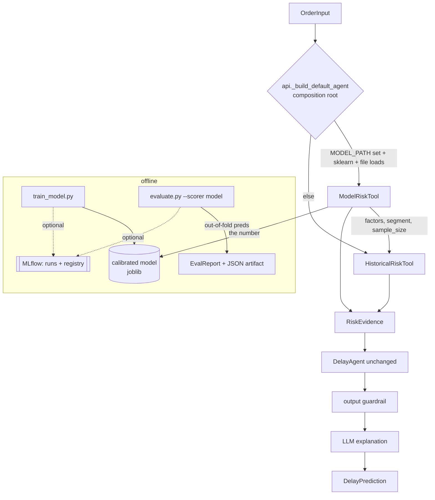

# Modelo ML + MLflow Design

**Spec**: `.specs/features/modelo-ml-mlflow/spec.md`
**Status**: Draft

---

## Architecture Overview

The model becomes the **source of the risk number**; the historical tool stays as the source of **evidence factors** and as the **fallback**. `ModelRiskTool` composes `HistoricalRiskTool` behind the identical `estimate_delay_risk(order) -> RiskEvidence` seam, so `agent.py` is untouched (AD-008, confirmed approach: Compose). The LLM stage (AD-005/AD-006) is unchanged — it still only rewrites prose over the number.

**Serving:** in-process, model loaded once at startup via `joblib` (mirrors `HistoricalRiskTool.from_path`). No serving container. MLflow is **only** for offline tracking/registry — never in the request path.

**Train/serve skew guard:** one shared encoding module produces the identical feature vector from both `OrderFeature` (train) and `OrderInput` (serve). `sellers_count` is the only training column not reconstructable from `OrderInput`, so it is excluded everywhere.

---

## Code Reuse Analysis

### Existing Components to Leverage

| Component | Location | How to Use |
| --------- | -------- | ---------- |
| `HistoricalRiskTool` | `backend/app/risk_tool.py:31` | Composed by `ModelRiskTool` for factors/segment/sample_size + fallback |
| `_risk_level(score)` | `backend/app/risk_tool.py:109` | Reused unchanged to map model probability → low/medium/high |
| `RiskEvidence` (Pydantic) | `backend/app/schemas.py:45` | Returned as-is; use `model_copy(update=…)` to override score/level/factors |
| `OrderFeature` / `load_prepared_features` | `backend/app/data_prep.py:19,149` | Training matrix source (X) + target `delayed` (y) |
| `EvalReport` + `compute_report` + `render_report` | `backend/app/evaluate.py` | Same report/alarm/calibration/per-state math on model out-of-fold preds |
| `DelayAgent` | `backend/app/agent.py:14` | **Unchanged** — duck-typed on `estimate_delay_risk` |
| `_build_default_agent` | `backend/app/api.py:107` | Composition root: selects Model vs Historical tool by env |

### Integration Points

| System | Integration Method |
| ------ | ------------------ |
| `agent.py` | None — same seam, no change |
| `api.py` | `_build_default_agent` picks `ModelRiskTool.from_paths(...)` when `MODEL_PATH` set + loadable; else `HistoricalRiskTool` |
| `evaluate.py` | New `--scorer {historical,model}`, `--model-path`, `--json-out`; optional MLflow logging |
| Docker Compose | New `mlflow` service under `profiles: [mlflow]` |

---

## Components

### Feature encoding (shared train/serve)  — ML-02

- **Purpose**: Turn both `OrderFeature` and `OrderInput` into one identical feature vector, excluding `sellers_count`.
- **Location**: `backend/app/feature_encoding.py` (new)
- **Interfaces**:
  - `FEATURE_COLUMNS: list[str]` — ordered feature names (no `order_id`, no `delayed`, no `sellers_count`)
  - `CATEGORICAL_COLUMNS: list[str]` — `customer_state, seller_state, same_state, product_category_name, payment_type_main`
  - `features_from_order_feature(f: OrderFeature) -> dict` — training rows
  - `features_from_order_input(o: OrderInput) -> dict` — serving rows; parses timestamp→`purchase_month/weekday`, `(estimated-purchase)`→`promised_days`, `price`→`total_price`, `freight_value`→`total_freight`, derives `same_state`/`freight_ratio`; missing → `None`
- **Dependencies**: `datetime` (stdlib), schemas
- **Reuses**: field derivation logic mirrored from `data_prep.build_order_features`
- **Note**: single source of the mapping — the AC-1 skew test asserts a matched pair encodes equal.

### Model training  — ML-03, MLF-02, ML-07

- **Purpose**: Fit and persist a calibrated classifier from prepared data.
- **Location**: `backend/app/train_model.py` (new, runnable `python -m app.train_model`)
- **Pipeline**: `OrdinalEncoder(handle_unknown="use_encoded_value", unknown_value=-1, encoded_missing_value=-2)` on categoricals → `HistGradientBoostingClassifier(categorical_features=…)` wrapped in `CalibratedClassifierCV(method="isotonic", cv=5)`.
- **Interfaces**:
  - `build_pipeline() -> Pipeline`
  - `train(prepared_path, model_path, mlflow_enabled=…) -> TrainSummary` — persists `joblib.dump(pipeline, model_path)`; optional `mlflow.sklearn.log_model` + register
- **Dependencies**: `scikit-learn`, `joblib` (in `requirements-ml.txt`), optional `mlflow`
- **Reuses**: `load_prepared_features`, `feature_encoding`

### ModelRiskTool  — ML-01, ML-04, ML-05

- **Purpose**: Produce the risk number from the model while delegating evidence to the historical tool; degrade to historical on any model failure.
- **Location**: `backend/app/model_risk_tool.py` (new)
- **Interfaces**:
  - `__init__(historical: HistoricalRiskTool, model)` — `model` may be `None`
  - `estimate_delay_risk(order: OrderInput) -> RiskEvidence`:
    1. `ev = historical.estimate_delay_risk(order)`
    2. if `model is None`: return `ev` (pure fallback)
    3. `p = model.predict_proba([features_from_order_input(order)])[0][1]`
    4. return `ev.model_copy(update={"risk_score": round(p,4), "risk_level": _risk_level(p), "factors": [f"score do modelo calibrado: {p:.1%} (probabilidade de atraso prevista)", *ev.factors]})`
  - `from_paths(prepared_path, model_path, min_segment_size=…) -> ModelRiskTool` — guarded `import sklearn/joblib`; missing dep **or** missing/corrupt file → `model=None` (never raises)
- **Dependencies**: `HistoricalRiskTool`, `_risk_level`, optional `joblib`/`sklearn`
- **Reuses**: everything above; keeps historical `confidence`, `segment_used`, `sample_size`, `fallback_used`
- **Guardrail safety**: `_validate_evidence` (explanation.py:58) checks only `factors`/`segment_used`/`sample_size>0` — all preserved from historical, so the output guardrail still passes.

### MLflow tracking wrapper  — MLF-01

- **Purpose**: Log eval runs / models to MLflow when configured; no-op otherwise.
- **Location**: `backend/app/mlflow_tracking.py` (new)
- **Interfaces**:
  - `enabled() -> bool` — true only if `MLFLOW_TRACKING_URI` set **and** `mlflow` importable
  - `log_eval_run(report: EvalReport, params: dict) -> None` — logs metrics (recall/precision/per-band/fallback) + params; no-op when disabled
- **Dependencies**: optional `mlflow`
- **Reuses**: `EvalReport`

### evaluate.py extension  — ML-06, ML-08, MLF-01

- **Purpose**: Score the model on the same report harness and emit report evidence.
- **Location**: `backend/app/evaluate.py` (modify)
- **Changes**:
  - args: `--scorer {historical,model}` (default `historical`), `--model-path`, `--json-out`
  - model path: `cross_val_predict(pipeline, X, y, cv=5, method="predict_proba")` → **out-of-fold** probability per order (every order scored by a model that did not train on it — the model-equivalent of the baseline's leave-one-out; documented in-report).
  - map OOF prob → risk band via `_risk_level`; feed into the existing `compute_report` alarm/band/**per-state** math.
  - `--json-out`: dump the full `EvalReport` (overall + per-band + per-state + alarm TP/FP/FN) to JSON for the report; call `mlflow_tracking.log_eval_run`.
- **Reuses**: `compute_report`, `render_report`, per-state aggregation

---

## Data Models

### Encoded feature vector

Keys = `FEATURE_COLUMNS`:
`customer_state, seller_state, same_state, product_category_name, purchase_month, purchase_weekday, promised_days, total_price, total_freight, freight_ratio, items_count, payment_type_main, max_installments` — **`sellers_count` excluded**. Missing values → `None` → encoder missing sentinel / NaN (HGB native).

### Model artifact

`backend/data/model.joblib` — pickled sklearn `Pipeline`. Gitignored like `prepared_orders.jsonl`; produced at build time or committed for demo (see Risks). Env `MODEL_PATH` points the API at it.

### EvalReport JSON artifact

`backend/data/eval_<scorer>.json` — serialized `EvalReport`. Two files (`eval_historical.json`, `eval_model.json`) are the committed, diff-able comparison evidence (ML-08 AC-3).

---

## Error Handling Strategy

| Error Scenario | Handling | User Impact |
| -------------- | -------- | ----------- |
| `MODEL_PATH` unset | API builds `HistoricalRiskTool` | Baseline scoring, no error |
| `sklearn`/`joblib` not installed | `from_paths` → `model=None` → historical | Baseline scoring, no error (ML-04) |
| Model file missing/corrupt | caught in `from_paths` → `model=None` | Historical fallback, `fallback_used` reflects historical |
| Request fields absent at serve | encoded as missing → model still scores | Model number returned, no fallback from missing fields alone |
| `MLFLOW_TRACKING_URI` unset / mlflow absent | `mlflow_tracking.enabled()` false → no-op | Train/eval complete normally (MLF-01/AC-3) |
| Empty dataset | historical returns sample_size=0 → 503 at startup (unchanged) | Existing behavior |

---

## Risks & Concerns

| Concern | Location | Impact | Mitigation |
| ------- | -------- | ------ | ---------- |
| True leave-one-out infeasible for a trained model | evaluate.py | Unfair/optimistic metrics if scored on training data | Use `cross_val_predict` out-of-fold preds; document as the model-equivalent of baseline LOO |
| Explanation shows model score but historical rate in factors | model_risk_tool | Mild human-readable inconsistency | Prepend explicit "score do modelo calibrado: …" factor so the number's source is stated |
| `RiskEvidence` is Pydantic, not namedtuple | schemas.py:45 | `_replace` would fail | Use `model_copy(update=…)` |
| sklearn version drift breaks `joblib.load` | requirements-ml.txt | Model won't deserialize | Pin `scikit-learn==` exact version; retrain script (ML-07) regenerates |
| Render Free 512 MB + sklearn (~100 MB) | deploy | Model-enabled API may not fit free tier | API stays fallback-capable; model demo via `docker compose` locally; report documents both modes honestly |
| Calibration could regress vs baseline | train/eval | Loses the baseline's main strength | Isotonic calibration + ML-06 AC-3 asserts bands stay ordered; else it's a fix task |

---

## Tech Decisions (only non-obvious ones)

| Decision | Choice | Rationale |
| -------- | ------ | --------- |
| Model class | `HistGradientBoostingClassifier` + isotonic `CalibratedClassifierCV` | Native NaN/categorical, calibrated probs, no pandas; beats LogReg on imbalanced tabular. Rejected: XGBoost/LightGBM/NN (extra deps, no gain on ~96k×13) |
| Composition | `ModelRiskTool` wraps `HistoricalRiskTool` | agent.py untouched; single fallback site; clean "model=number, historical=evidence" report story (confirmed) |
| Eval fairness | out-of-fold `cross_val_predict` | Only feasible honest analogue to baseline leave-one-out |
| Dep isolation | `requirements-ml.txt` separate from API `requirements.txt` | API image builds/serves without sklearn/mlflow (ML-04, success criteria) |
| MLflow scope | tracking + registry only, guarded/optional | Realizes course competency without becoming a runtime dependency (AD-008) |

> **Project-level decision** already recorded as **AD-008** in `.specs/STATE.md`. No new AD needed.
